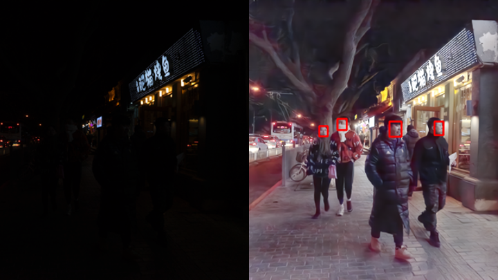

# HackTheLab - FacialRecognitionForAll

# Track - Using ComputerScience to solve a real world problem

## Problem statement

How can we de-bias automated facial recognition models for greater accuracy for all users?

## Specific problem statement

From our research, we have found that people with darker skin tone tend to be wrongly classified [10 to 100 times more than Caucasian faces](https://www.technologyreview.com/2019/12/20/79/ai-face-recognition-racist-us-government-nist-study/) with the latest facial recognition systems. Furthermore, for "one-to-many" searching, which involves determining if a subject is present in a database, "systems had the **worst false positive rates for African-American women**", putting them "at the **highest risk for being falsely accused of a crime**".

## Proposed solution

While our team is **not** working on facial classification due to time constraints (current models take far longer to detect the ethnicity of a face than to recognise a face), we seek to improve facial recognition softwares for individuals with a darker skin tone. Specifically, **we investigated whether enhancing images taken in low light would significantly improve the accuracy of algorithms in detecting faces**. . 

Note: Our research **does not** claim to improve the accuracy of facial classification systems yet. Further studies would have to be done in order to
1. Verify if these enhanced images would also reduce false positive rates in "one-to-many" searching
2. Verify if the accuracy of facial **classification** (not recognition) systems would increase by a significant extent too

At the same time, we are aware that one of the key challenges of AI is [bias built into data](https://www.brookings.edu/blog/techtank/2019/01/03/artificial-intelligence-and-bias-four-key-challenges/). As such, **we developed a web application, integrated wtih Coil API, to incentivise individuals from marginalised groups to upload pictures of themselves**, crowdsourcing for more data. Specifically, individuals who upload pictures from more marginalised groups (they may self-select a category, and images are to be vetted by a content moderation team), will receive a monetary incentive. These monetary incentives are to be funded by other individuals looking to use our dataset or donors that believe in this cause.

## Research in Ethical AI

With current models having a higher error rate in [recognising faces of people of darker skin tones](https://venturebeat.com/ai/nist-benchmarks-show-facial-recognition-technology-still-struggles-to-identify-black-faces/), we wanted to improve these models by enhancing photos of darker skin tone people, to allow features of the models to better detect facial features.

First, we dived into facial recognition software such as RetinaFace and tested it on UTKFace dataset. However, testing on these models took far longer than expected and we decided to go into facial detection instead.

Next, we wrote a programme using opencv to detect faces of people. Afterwhich, we used PIL to enhance these images using a few different features.

## Image enhancer & classification
We applied the [LLFlow](https://github.com/wyf0912/LLFlow) model onto a dataset filled with extremely dark images that contain multiple faces to evaluate if the latest state-of-the-art facial recognition systems ([RetinaFace](https://github.com/serengil/retinaface)) will have a significantly greater facial recognition accuracy.

Our hypothesis is that if images may be enhanced using AI to improve the accuracy of facial recognition models, there will be a decrease in false positive rates for facial classification models performing a "one-to-many" search.

### Installation guide
1. `git clone https://github.com/seancze/LLFlow`
   1. Follow the configuration settings found in the repository's `README.md` (more specific instructions on how to get your image enhancer running may be found in `final.ipynb`)
2. `pip install -r requirements.txt`
3. Download the [Dark Face Dataset](https://www.kaggle.com/datasets/soumikrakshit/dark-face-dataset) on Kaggle into your `./images/dark-face` folder
4. Download [Part 1 of the UTK Face Dataset](https://susanqq.github.io/UTKFace/) into your `./images/UTKFace/part1` folder
5. Open the `final.ipynb` jupyter notebook and run all cells

## Website Development

We have created a website as a product. The problem of there being poor facial recognition for people with darker skin tones can and should be solved with simply having more labeled training data. Unfortunately, we quickly discovered that labeled training data of minorities is substantially more obscure than that of the majority. In a bid to solve this, my group designed a website that hosts a publicly available dataset of minority individuals. The features are as follows

1. Create an account and log in, which is facilitated by [CockroachDB](https://www.cockroachlabs.com/)
2. Upload an image of themselves, which our AI will then recognise as whether it is a face, and will contribute to the dataset if approved
3. Users will be able to download the data
4. [Coil](https://coil.com/) users who visit the site will contribute funds to support the maintenance of the site and the redistribution to the contributors of the dataset
5. All users can donate to the site to contribute funds to support the maintenance of the site and the redistribution to the contributors of the dataset

Unfortunately, due to time constraints, some of these features are only available for demo and do not work.
email: admin
password: admin123

## Future work
Due to time constraints, we were only able to enhance a limited number of images, and pass an even fewer number through the existing state-of-the-art facial recognition model, RetinaFace. **More processed images can, and should be fed into existing facial recognition systems to verify our results**.

Additionally, due to time constraints, we were unable to validate our hypothesis that improving facial recognition in low light will result in better facial classification for African Americans, at least in terms of reducing false positive rates for "one-to-many" searching. **Future research ought to focus on passing our processed images through these "one-to-many" searching algorithms**, and evaluating if the false positive rates drop by a significant extent.

Furthermore, with regards to our web platform, while we have shown that it is technically feasible to implement, **a significant amount of manpower will still be required** to ensure that users uploading images correctly classify the ethnicity of their images uploaded, and do not abuse the system by consistently selecting the rarest category that provides the highest reward.

## Learnings

Our team is composed of students who have never been exposed to Computer Vision (CV). Through this project, we gained a much deeper understanding in multiple aspects of CV including, but not limited to:
1. The challenges involved in facial recognition (biased datasets, high false positive rates, poor quality images, and etc)
2. How to implement existing pretrained models
3. How to combine various models together to improve the overall classification accuracy
4. Industry standard evaluation metrics (e.g. mAP (mean Average Precision score) for determining the accuracy of an object recognition model
5. Where to locate datasets

Additionally, while we may have had some exposure to web development, we also had the opportunity to better learn new softwares. Specifically, integrating webpages with Coil and CockroachDB.

On the less technical side, we honed our abilities in
1. Pouring through research papers in a short period of time
2. Ideating & communicating effectively as our team met-up physically for this hackathon
3. Pair programming (which involves not just the actual programming, but a lot of communication)
4. Delegation of work
